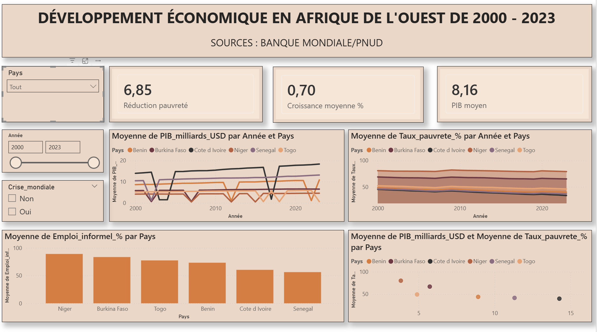

# 📈 Economic Development Dashboard — West Africa (2000–2023)


> An interactive Power BI dashboard analyzing GDP growth, poverty reduction, informal employment, and foreign direct investment across 6 West African countries over 24 years — designed to support economic policy analysis, NGO strategy, and development finance decisions.

---

## 📊 Dashboard Preview



---

## 🎯 Project Objective

Economic development in West Africa is uneven, complex, and often poorly visualized. This project provides a **multi-country, longitudinal view** of key economic indicators — making it easier for analysts, policymakers, and development organizations to:

- Compare GDP trajectories across coastal vs. landlocked economies
- Track poverty reduction progress from 2000 to 2023
- Understand the structural weight of informal employment by country
- Isolate the economic impact of global crises (2008–2009 financial crisis, 2020 COVID-19)
- Correlate GDP levels with poverty rates across 6 ECOWAS nations

---

## 🔍 Key Findings

| Indicator | Value |
|---|---|
| Average GDP across 6 countries | **~$8.16 billion USD** |
| Average GDP growth rate | **~0.70% per year** |
| Average poverty reduction (2000–2023) | **~6.85 percentage points** |
| Highest informal employment | **Niger (~89%)** |
| Lowest informal employment | **Senegal (~56%)** |
| Most consistent GDP growth | **Côte d'Ivoire** |

### 3 Key Insights

**1. Coastal economies outperform landlocked ones consistently**
Benin, Côte d'Ivoire, Senegal, and Togo show higher and more stable GDP growth than Niger and Burkina Faso — driven by port access, trade diversification, and stronger FDI attraction.

**2. Global crises hit the poorest countries hardest**
The 2008–2009 financial crisis and the 2020 COVID-19 shock created visible dips across all 6 economies — but recovery speed was significantly faster in countries with larger formal sectors.

**3. Informal employment is the structural challenge of the region**
With 56% to 89% of workers in the informal sector depending on the country, formal job creation remains the single biggest lever for sustainable poverty reduction in West Africa.

---

## 🛠️ Tools & Methodology

| Step | Tool |
|---|---|
| Data simulation | Python (csv, random) |
| Data cleaning & transformation | Power Query (Power BI) |
| Data modeling | DAX measures |
| Visualization | Power BI Desktop |

**Data source:** Dataset modeled after World Bank Open Data and UNDP Human Development Reports. Indicators follow standard definitions used in development economics (GDP in constant USD, headcount poverty ratio at $2.15/day PPP, ILO informal employment definition).

**Countries covered:** Benin 🇧🇯 · Burkina Faso 🇧🇫 · Côte d'Ivoire 🇨🇮 · Niger 🇳🇪 · Senegal 🇸🇳 · Togo 🇹🇬

---

## 📁 Repository Structure

```
├── eco_afrique_ouest_v2.csv    # Dataset (144 rows, 10 variables)
├── dashboard_preview.png       # Dashboard screenshot
├── dashboard_eco.pbix          # Power BI dashboard file
└── README.md                   # Project documentation
```

---

## 📌 Variables in the Dataset

| Column | Description |
|---|---|
| `Pays` | Country name |
| `Région` | Coastal or Landlocked |
| `Année` | Year (2000–2023) |
| `PIB_milliards_USD` | GDP in billions USD |
| `Taux_croissance_PIB_%` | Annual GDP growth rate (%) |
| `Taux_pauvrete_%` | Poverty headcount ratio (%) |
| `Taux_chomage_%` | Unemployment rate (%) |
| `Emploi_informel_%` | Informal employment share (%) |
| `IDE_%_PIB` | Foreign direct investment as % of GDP |
| `Crise_mondiale` | Global crisis year (Oui/Non) |

---

## 💡 How to Use This Dashboard

1. Download `dashboard_eco.pbix` and open with [Power BI Desktop](https://powerbi.microsoft.com/desktop/) (free)
2. Use the **Pays** filter to focus on one or more countries
3. Use the **Année** slider to zoom into a specific period
4. Toggle **Crise_mondiale** to isolate crisis vs. normal years
5. Hover over data points in the scatter plot to identify country-specific patterns

---

## 🔗 Related Projects

| Project | Description | Link |
|---|---|---|
| 🌾 Food Security Dashboard | Food insecurity monitoring across 12 departments of Benin | [View →](https://github.com/webmastrick/food-security-benin-dashboard) |
| 🌍 Portfolio | All projects and skills | [View →](https://webmastrick.github.io) |

---

## 👤 About the Author

**Patrick Alloumon Gbeho**
Webmaster & Junior Data Analyst — Cotonou, Benin 🇧🇯

I specialize in building data dashboards and web solutions for organizations across West Africa — combining local context expertise with international data standards.

- 🌍 Open to remote collaboration worldwide
- 💼 Available for freelance projects, NGO partnerships, and data consulting
- 🔗 [Portfolio](https://webmastrick.github.io) · [GitHub](https://github.com/webmastrick) · [LinkedIn](https://linkedin.com/in/)

---

## 📜 License

This project is open source under the [MIT License](./LICENSE).
Feel free to fork, adapt, and build upon this work — credit appreciated.

---

*Built with 🌍 from Cotonou, Benin*
